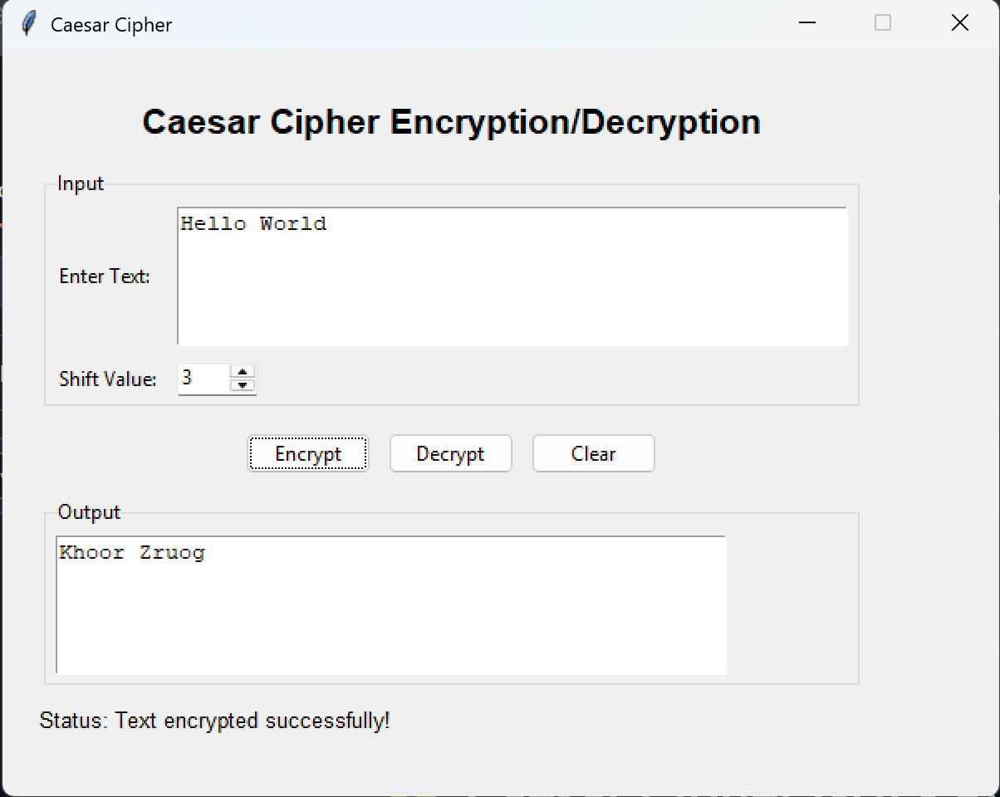

# PRODIGY_CS_01
This is my project for Prodigy InfoTech

# 🔐 Caesar Cipher GUI - Python

## Overview
This is a **Caesar Cipher GUI** application built using **Python and Tkinter**. It allows users to encrypt and decrypt text using the **Caesar Cipher algorithm** with a specified shift value.

## Features
✅ Encrypts and decrypts text using the Caesar Cipher method.  
✅ User-friendly GUI with text input and shift value selection.  
✅ Supports uppercase, lowercase, and special characters.  
✅ Clear input/output and status updates.  
✅ Simple and lightweight application.

## Requirements
Make sure you have Python installed. This application uses:
- **Python 3.x**
- **Tkinter** (comes pre-installed with Python)

## Installation & Usage
# PRODIGY_CS_01  
This is my project for Prodigy InfoTech

# 🔐 Caesar Cipher GUI - Python

## Overview
This is a **Caesar Cipher GUI** application built using **Python and Tkinter**. It allows users to encrypt and decrypt text using the **Caesar Cipher algorithm** with a specified shift value.

## Features
✅ Encrypts and decrypts text using the Caesar Cipher method.  
✅ User-friendly GUI with text input and shift value selection.  
✅ Supports uppercase, lowercase, and special characters.  
✅ Clear input/output and status updates.  
✅ Simple and lightweight application.

## Requirements
Make sure you have Python installed. This application uses:
- **Python 3.x**
- **Tkinter** (comes pre-installed with Python)

## Installation & Usage

### 1. Clone or Download the Project
```bash
git clone https://github.com/MuhdSulthan/PRODIGY_CS_01.git
cd PRODIGY_CS_01
```

### 3. How to Use
1. Enter the **text** you want to encrypt or decrypt.
2. Provide a **shift value** (e.g., 3 shifts letters forward/backward).
3. Click **Encrypt** to get the encrypted text.
4. Click **Decrypt** to decode a previously encrypted text.
5. Click **Clear** to repeat the process.

## Example Usage
**Encryption:**  
  - Input: `Hello World`
  - Shift: `3`
  - Output: `Khoor Zruog`

**Decryption:**  
  - Input: `Khoor Zruog`
  - Shift: `3`
  - Output: `Hello World`
## 🖼️Preview

    
